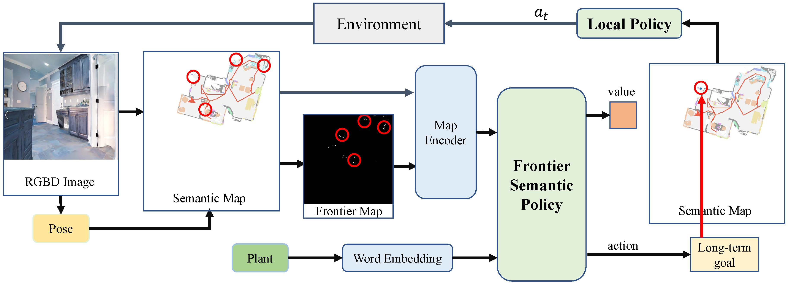

# Frontier Semantic Policy for Visual Target Navigation

This work is based on our paper. We proposed a new framework to explore and search for the target in unknown environment. Our work is based on [RedNet](https://github.com/JindongJiang/RedNet),   [SemExp](https://github.com/devendrachaplot/Object-Goal-Navigation) and [Invalid Action Masking](https://github.com/neurips2020submission/invalid-action-masking), implemented in PyTorch.

**Author:** Bangguo Yu, Hamidreza Kasaei and Ming Cao

**Affiliation:** University of Groningen

## Frontier Semantic Exploration Framework

This work focuses on the problem of visual target navigation, which is very important for autonomous robots
as it is closely related to high-level tasks. To find a special object in unknown environments, classical and learning-based approaches are fundamental components of navigation that have been investigated thoroughly in the past. However, due to the difficulty in the representation of complicated scenes
and the learning of the navigation policy, previous methods are still not adequate, especially for large unknown scenes. Hence, we propose a novel framework for visual target navigation using the frontier semantic policy. In this proposed framework, the semantic map and the frontier map are built from the
current observation of the environment. Using the features of the maps and object category, deep reinforcement learning enables to learn a frontier semantic policy which can be used to select a frontier cell as a long-term goal to explore the environment efficiently. Experiments on Gibson and Habitat-
Matterport 3D (HM3D) demonstrate that the proposed framework significantly outperforms existing map-based methods in terms of success rate and efficiency. Ablation analysis also indicates that the proposed approach learns a more efficient exploration policy based on the frontiers. A demonstration is provided to verify the applicability of applying our model to real-world transfer. The supplementary video and code can be accessed via the following link: https://yubangguo.com/project/frontier-semantic-exploration.



<!-- ## Requirements

- Ubuntu 20.04
- Python 3.7
- [habitat-lab](https://github.com/facebookresearch/habitat-lab) -->

## Installation

The code has been tested only with Python 3.7, CUDA 10.0 on Ubuntu 20.04.

1. Installing Dependencies
- We use challenge-2022 versions of [habitat-sim](https://github.com/facebookresearch/habitat-sim) and [habitat-lab](https://github.com/facebookresearch/habitat-lab) as specified below:

-Installing habitat-sim:
```
git clone https://github.com/facebookresearch/habitat-sim.git
cd habitat-sim; git checkout tags/challenge-2022; 
pip install -r requirements.txt; 
python setup.py install --headless
python setup.py install # (for Mac OS)
```

-Installing habitat-lab:
```
git clone https://github.com/facebookresearch/habitat-lab.git
cd habitat-lab; git checkout tags/challenge-2022; 
pip install -e .
```

- Install [pytorch](https://pytorch.org/) according to your system configuration. The code is tested on pytorch v1.6.0 and cudatoolkit v10.2. If you are using conda:
```
conda install pytorch==1.6.0 torchvision==0.7.0 cudatoolkit=10.2 #(Linux with GPU)
conda install pytorch==1.6.0 torchvision==0.7.0 -c pytorch #(Mac OS)
```

- Install [detectron2](https://github.com/facebookresearch/detectron2/) according to your system configuration. If you are using conda:
```
python -m pip install detectron2 -f https://dl.fbaipublicfiles.com/detectron2/wheels/cu102/torch1.6/index.html #(Linux with GPU)
CC=clang CXX=clang++ ARCHFLAGS="-arch x86_64" python -m pip install 'git+https://github.com/facebookresearch/detectron2.git' #(Mac OS)
```

2. Download HM3D datasets:

#### Habitat Matterport
Download [HM3D](https://aihabitat.org/datasets/hm3d/) dataset using download utility and [instructions](https://github.com/facebookresearch/habitat-sim/blob/089f6a41474f5470ca10222197c23693eef3a001/datasets/HM3D.md):
```
python -m habitat_sim.utils.datasets_download --username <api-token-id> --password <api-token-secret> --uids hm3d_minival
```

3. Download segmentation model

Download the [segmentation model]() in RedNet/model path.


## Setup
Clone the repository and install other requirements:
```
git clone https://github.com/ybgdgh/Frontier-Semantic-Exploration/
cd Frontier-Semantic-Exploration/
pip install -r requirements.txt
```

### Setting up datasets
The code requires the datasets in a `data` folder in the following format (same as habitat-lab):
```
Object-Goal-Navigation/
  data/
    scene_datasets/
    versioned_data
    objectgoal_hm3d/
        train/
        val/
        val_mini/
```


### For evaluation: 
For evaluating the pre-trained model:
```
python main_f_policy_gl_iam.py --split val --eval 1 --auto_gpu_config 0 -n 1  --load pretrained_models/model_f_p_iam_new.pth --use_gtsem 0 -v 1
```


## Demo Video

[video](https://yubangguo.com/project/frontier-semantic-exploration)